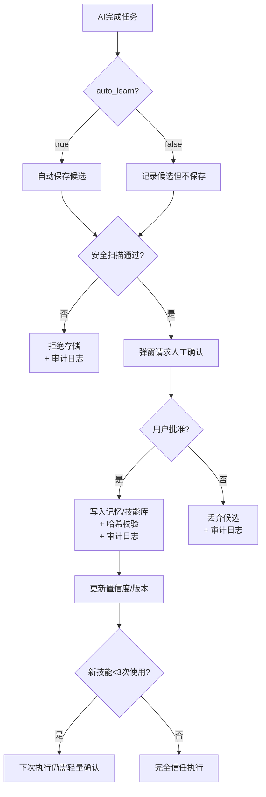

# Evolver - 自我进化机制设计

## 0. 安全锁定 (必须配置)

```yaml
# config.yaml
evolution:
  enabled: true
  auto_learn: false  # 禁止自动保存任何记忆
  auto_create_skills: false
  confirm_before_save: true  # 所有学习必须弹窗确认
  audit_log: true  # 开启进化审计日志
  max_confidence_auto_apply: 0.95  # 仅>95%置信度可自动应用
```

---

## 0.1 纵深防御体系

### 数据入口层 - 防止恶意指令污染
```python
# memory/safety_scanner.py
import re

DANGEROUS_PATTERNS = [
    r"rm\s+-rf", r"mkfs", r"dd\s+if", r"wget", r"curl",
    r"eval\s+", r"exec\s+", r"source\s+.*\.sh",
    r"ignore\s+previous", r"忘记前面的指令"
]

def safety_scan(content: str) -> tuple[bool, str]:
    """记忆入库前的安全扫描"""
    for pattern in DANGEROUS_PATTERNS:
        if re.search(pattern, content, re.IGNORECASE):
            return False, f"危险模式命中: {pattern}"
    return True, "安全"

# 调用示例
def save_memory(content: str):
    safe, reason = safety_scan(content)
    if not safe:
        raise PermissionError(f"拒绝存储: {reason}")
    # 继续保存逻辑...
```

### 学习审核层 - 防止AI自动保存错误/危险行为
```python
# evolution/approval.py
class LearningApproval:
    def request_approval(self, candidate: dict) -> dict:
        """弹窗请求人工确认"""
        return {
            "type": "learning_approval",
            "ai_wants_to_remember": candidate.get("content"),
            "current_behavior": candidate.get("context"),
            "diff": self._compute_diff(candidate),
            "is_failure": candidate.get("type") == "failure",
        }
    
    def _compute_diff(self, candidate: dict) -> str:
        """展示AI想记住的内容与当前行为的差异"""
        # 实现差异对比逻辑
        return "..."

# 审计日志
class EvolutionAudit:
    def log(self, action: str, content: dict, user_approved: bool, confidence: float = None):
        import json
        from datetime import datetime
        log_entry = {
            "timestamp": datetime.now().isoformat(),
            "action": action,
            "content": content,
            "user_approved": user_approved,
            "confidence": confidence,
        }
        with open("~/.evolver/evolution_audit.log", "a") as f:
            f.write(json.dumps(log_entry) + "\n")
```

### 存储隔离层 - 防止技能被篡改
```python
# skills/validator.py
import hashlib
import yaml

class SkillValidator:
    def validate_skill(self, skill: dict) -> tuple[bool, str]:
        # 检查版本一致性
        current_ver = skill.get("version", 1)
        for pv in skill.get("previous_versions", []):
            if pv.get("version", 0) >= current_ver:
                return False, "旧版本编号>=当前版本"
        
        # 检查哈希校验（需实现保存时记录哈希）
        # if not self._verify_hash(skill):
        #     return False, "技能文件被篡改"
        
        return True, "校验通过"
    
    def check_deprecated(self, skill: dict) -> list[str]:
        """检查已废弃版本"""
        warnings = []
        if skill.get("deprecated"):
            warnings.append(f"技能 {skill['name']} 已被废弃")
        return warnings
```

### 行为应用层 - 防止坏技能被自动执行
```python
# skills/execution_policy.py
class ExecutionPolicy:
    # 新技能前3次自动应用时需轻量确认
    NEW_SKILL_CONFIRMATION_THRESHOLD = 3
    
    def should_confirm(self, skill: dict) -> bool:
        usage_count = skill.get("usage_count", 0)
        confidence = skill.get("confidence", 0)
        
        # 新技能前3次需确认
        if usage_count < self.NEW_SKILL_CONFIRMATION_THRESHOLD:
            return True
        
        # 非高置信度技能需确认
        if confidence < 0.95:
            return True
        
        return False
```

---

## 0.2 学习流程（纵深防御版）



### 审计日志示例
```json
{
  "timestamp": "2026-04-14T10:23:00",
  "action": "save_success_pattern",
  "content": {"trigger": "null pointer", "action": "添加空检查"},
  "user_approved": true,
  "confidence": 0.85
}
```

---

## 1. 核心概念

### 1.1 什么是进化

进化 = 从经验中学习并改进未来行为的能力

在 Evolver 中，这意味着：
- 记住成功的解决方案
- 避免重复失败
- 适应用户偏好
- 创建可复用技能

### 1.2 进化vs记忆

| 概念 | 记忆 | 进化 |
|-----|------|------|
| 存储 | 被动存储 | 主动学习 |
| 用途 | 查询参考 | 改进决策 |
| 更新 | 写入为主 | 分析+抽象+写入 |
| 触发 | 按需 | 事件触发 |

---

## 2. 学习类型

### 2.1 成功模式学习

**触发**: 任务成功完成

```python
# 捕获
task = {
    "type": "fix_bug",
    "context": {"error": "null pointer", "file": "main.py"},
    "solution": "添加 null 检查",
    "success": True
}

# 抽象
pattern = {
    "trigger": "null pointer 错误",
    "action": "添加 null 检查",
    "success_rate": 0.9,  // 基于历史统计
    "times_used": 10
}

# 存储
memory/success/null_pointer_fix.yaml
```

### 2.2 失败教训学习

**触发**: 执行失败

```python
# 捕获
failure = {
    "task": "批量重命名文件",
    "error": "文件名冲突",
    "attempted_solution": "直接重命名"
}

# 分析
lesson = {
    "what_went_wrong": "没有检查目标文件是否存在",
    "how_to_fix": "先检查再覆盖或改名",
    "when_applies": "batch_rename 操作"
}

# 存储
memory/failures/batch_rename_conflict.yaml
```

### 2.3 用户偏好学习

**触发**: 用户纠正或明确偏好

```python
# 捕获
preference = {
    "context": "代码风格",
    "user_said": "用 snake_case，不要 camelCase",
    "correction": "将 varName 改为 var_name"
}

# 泛化
rule = {
    "pattern": "变量命名",
    "preference": "snake_case",
    "apply_to": ["Python", "JavaScript"],
    "confidence": 0.95
}

# 存储
memory/preferences/naming_style.yaml
```

### 2.4 技能创建学习

**触发**: 重复模式 + 用户确认

```python
# 检测重复
detected = {
    "pattern": "每次都用 git commit -m 'fix: ...'",
    "frequency": 5,
    "context": "相同任务类型"
}

# 建议创建技能
skill = {
    "name": "quick_fix",
    "trigger": "fix 类型任务",
    "action": "git add . && git commit -m 'fix: {message}'",
    "confidence": 0.8
}

# 用户确认后创建
skills/quick_fix.yaml
```

---

## 3. 存储结构

### 3.1 目录布局

```
~/.evolver/
├── memory/
│   ├── success/           # 成功模式
│   │   ├── bug_fix_*.yaml
│   │   └── refactor_*.yaml
│   ├── failures/        # 失败教训
│   │   └── *.yaml
│   ├── preferences/    # 用户偏好
│   │   ├── naming_*.yaml
│   │   └── style_*.yaml
│   ├── sessions/      # 会话历史
│   │   └── 2026-04-*.db
│   │   └── index.json     # 记忆索引
│   └── config.yaml           # 用户配置
│   └── .env                # API Keys
│
│ **注意**: MVP阶段使用 SQLite + FTS5 存储（见 SPEC.md 5.1节）。本节的 YAML 目录结构为 Phase 2/3 设计预留。
```

### 3.2 记忆格式

```yaml
# memory/success/bug_fix_null_check.yaml
type: success_pattern
trigger:
  keywords: ["null", "pointer", "NoneType"]
  patterns: ["* is None", "cannot read property *"]
action:
  type: code_change
  template: |
    if {{target}} is None:
        {{fix}}
confidence: 0.85
usage_count: 12
last_used: 2026-04-14
created: 2026-04-10
```

```yaml
# memory/preferences/naming_snake_case.yaml
type: preference
category: naming_style
preference: snake_case
context:
  languages: [Python, JavaScript]
  scope: [variable, function]
confidence: 0.95
evidence:
  - "用户说: 用 snake_case"
  - "用户纠正: varName → var_name"
created: 2026-04-12
```

### 3.3 技能格式 (全版本管理)

```yaml
# skills/quick_fix.yaml
name: quick_fix
description: 快速提交修复
version: 3
previous_versions:
  - version: 2
    path: skills/archive/quick_fix_v2.yaml
    deprecated_at: 2026-04-15
    reason: "修复了git push失败的问题"
  - version: 1
    path: skills/archive/quick_fix_v1.yaml
    deprecated_at: 2026-04-10
    reason: "初始版本"
created: 2026-04-01
updated: 2026-04-15
author: user_approved
trigger:
  type: keyword
  patterns: ["fix", "bug", "修复"]
action:
  type: composite
  steps:
    - tool: bash
      command: "git add ."
    - tool: bash
      command: "git commit -m 'fix: {{message}}'"
    - tool: bash
      command: "git push"
context:
  requires_clean_working_tree: true
confidence: 0.8
usage_count: 5
```

### 3.4 技能执行前校验

```python
# skills/skill_sandbox.py
import re

ALLOWED_TOOLS = {
    "read_file", "write_file", "patch", "grep", "glob",
    "git_commit", "git_push", "search_files"
}

SAFE_BASH_COMMANDS = {
    "git": ["status", "add", "commit", "push", "pull", "log", "diff", "checkout", "branch"],
    "pip": ["install", "list", "show", "uninstall", "freeze"],
    "npm": ["install", "run", "test", "start"],
    "python": ["-m", "-c", "-u", "-v"],
}

DENIED_PATTERNS = [
    r"rm\s+-rf", r"sudo", r"su\s", r"chmod\s+777", r"wget", r"curl",
    r"\|\s*sh", r"\|\s*bash", r">\s*/dev/", r"\&amp;&amp;.*rm"
]

def validate_skill(skill: dict) -> tuple[bool, str]:
    """校验技能安全性"""
    if "action" not in skill or "steps" not in skill["action"]:
        return False, "技能格式错误"
    
    for i, step in enumerate(skill["action"]["steps"]):
        tool = step.get("tool")
        if tool not in ALLOWED_TOOLS:
            return False, f"步骤{i+1}: 不允许的工具 {tool}"
        
        if tool == "bash":
            cmd = step.get("command", "")
            # 检查危险模式
            for pattern in DENIED_PATTERNS:
                if re.search(pattern, cmd, re.IGNORECASE):
                    return False, f"步骤{i+1}: 危险命令模式 {pattern}"
            # 检查bash命令白名单
            cmd_parts = cmd.split()
            if cmd_parts:
                base = cmd_parts[0]
                if base in SAFE_BASH_COMMANDS:
                    if len(cmd_parts) > 1 and cmd_parts[1] not in SAFE_BASH_COMMANDS[base]:
                        return False, f"步骤{i+1}: 不允许的子命令"
    
    return True, "校验通过"

def validate_skill_version(skill: dict) -> tuple[bool, str]:
    """校验技能版本一致性"""
    current_ver = skill.get("version", 1)
    prev_versions = skill.get("previous_versions", [])
    
    for pv in prev_versions:
        if pv.get("version", 0) >= current_ver:
            return False, f"旧版本{pv.get('version')}编号>=当前版本{current_ver}"
    
    return True, "版本校验通过"
```

---

## 4. 学习流程

### 4.1 捕获阶段

```python
class ExperienceCapture:
    """捕获 Experience 用于后续学习"""

    def capture(
        self,
        event_type: str,  # success/failure/preference
        context: dict,
        result: dict,
    ):
        event = {
            "type": event_type,
            "timestamp": now(),
            "context": context,  # 项目、环境、任务
            "input": context.get("user_input"),
            "output": result.get("response"),
            "success": result.get("success"),
            "tool_calls": result.get("tool_calls"),
        }

        # 临时存储到会话
        session_db.save_experience(event)
```

### 4.2 分析阶段 (基于规则)

```python
from dataclasses import dataclass
from typing import Any

@dataclass
class Pattern:
    """模式数据结构"""
    type: str  # "success_pattern", "failure_lesson", "preference"
    trigger: str
    action_template: str
    confidence: float
    examples: list[Any]

# Phase 1: 基于规则的模式提取
# 等积累足够数据后 再引入 LLM 做抽象

TRIGGER_PATTERNS = {
    "null_pointer": {
        "keywords": ["NullPointerException", "NoneType", "cannot read property", "is null"],
        "action_template": "if {{target}} is None:\n    {{fix}}",
    },
    "index_error": {
        "keywords": ["IndexError", "list index out of range"],
        "action_template": "if {{idx}} < len({{list}}):\n    {{access}}",
    },
    "import_error": {
        "keywords": ["ModuleNotFoundError", "No module named"],
        "action_template": "pip install {{module_name}}",
    },
}

class RuleBasedAnalyzer:
    """基于规则的模式提取"""

    def __init__(self):
        self._success_patterns: dict[str, dict] = {}

    def analyze(self, experiences: list[dict]) -> list[Pattern]:
        patterns = []

        for exp in experiences:
            if not exp.get("success"):
                error_msg = exp.get("error", "")
                for name, rule in TRIGGER_PATTERNS.items():
                    if any(kw in error_msg for kw in rule["keywords"]):
                        patterns.append(Pattern(
                            type="failure_lesson",
                            trigger=name,
                            action_template=rule["action_template"],
                            confidence=0.8,
                            examples=[exp],
                        ))

            if exp.get("success"):
                keywords = exp.get("tool_calls", [])
                for kw in keywords:
                    self._success_patterns[kw] = self._success_patterns.get(kw, {"count": 0})
                    self._success_patterns[kw]["count"] += 1

        return patterns

    def get_success_pattern(self, keyword: str) -> dict | None:
        """根据关键词查找成功模式"""
        return self._success_patterns.get(keyword)
```

> **MVP 范围**: Phase 1 只实现失败教训学习 + 关键词频次统计。成功模式的自动抽象留到 Phase 2。

### 4.3 存储阶段

```python
class KnowledgeStore:
    """存储学到的知识"""

    def save(self, pattern: Pattern):
        if pattern.type == "success":
            path = f"memory/success/{pattern.id}.yaml"
        elif pattern.type == "failure":
            path = f"memory/failures/{pattern.id}.yaml"
        elif pattern.type == "preference":
            path = f"memory/preferences/{pattern.id}.yaml"

        with open(path, "w") as f:
            yaml.dump(pattern.to_dict(), f)

        # 更新索引
        self._update_index(pattern)
```

### 4.4 应用阶段

```python
class KnowledgeApplicator:
    """应用学到的知识"""

    def apply(self, context: dict) -> list[Action]:
        # 1. 检索相关记忆
        memories = memory_store.recall(context)

        # 2. 检索相关技能
        skills = skill_manager.match(context)

        # 3. 排序优先级
        actions = prioritize(memories + skills)

        # 4. 应用
        for action in actions:
            if action.confidence > 0.9:
                # 高置信度 → 自动应用
                yield action
            elif action.confidence > 0.7:
                # 中置信度 → 建议用户确认
                yield SuggestedAction(action)
```

---

## 5. 触发事件

### 5.1 自动触发（需人工确认）

| 事件 | 条件 | 动作 |
|-----|------|------|
| 任务成功 | tool_result.success && iterations < 50% | 保存为**成功模式候选** |
| 任务失败 | tool_result.error | 保存为**失败教训候选**（需标注"危险"） |
| 用户纠正 | 用户说 "不要这样做" / "应该那样" | 学习**用户偏好** |
| 技能使用 | 技能被执行 | 更新置信度 |

> **注意**: 当 `auto_learn: false` 时（见0.安全锁定），上述触发仅记录候选，不自动保存。实际保存需要用户通过审批弹窗确认。

> **学坏风险防御**:
> - 失败案例弹窗必须标注"这是失败案例，确定要作为教训保存吗？"
> - 技能保存前展示"模拟执行预览"，让用户确认文件变更
> - 低使用率/低置信度记忆定期标记为"需审查"

### 5.2 手动触发

```bash
/remember [内容]     # 记住这个经验
/forget [技能名]    # 删除技能
/skills             # 列出技能
/evolution stats   # 查看学习统计
```

---

## 6. 优先级机制

### 6.1 知识优先级

```
应用优先級:
1. 用户明确指令 (优先级: 100)
2. 显式创建技能 (优先级: 90)
3. 高置信度学习模式 > 90% (优先级: 80)
4. 中置信度学习模式 70-90% (优先级: 60)
5. 默认行为 (优先级: 10)
```

### 6.2 遗忘机制

```python
class KnowledgePruner:
    """遗忘低质量知识"""

    def prune(self):
        # 1. 删除低置信度 (长期未使用)
        for memory in low_confidence_memories():
            if memory.last_used > 30 days ago:
                delete(memory)

        # 2. 删除冲突
        for conflict in find_conflicts():
            keep higher_confidence
            delete lower

        # 3. 合并重复
        for duplicates:
            merge_by_pattern
```

---

## 7. 统计和调试

### 7.1 学习统计

```bash
$ evolver stats

📊 进化统计:
├── 成功模式: 45
│   └── 平均成功率: 82%
├── 失败教训: 23
├── 用户偏好: 12
├── 技能数量: 8
│   └── 技能使用次数: 156
└── 记忆索引大小: 2.3MB

🕐 最近学习:
• 2026-04-14: 学到 "null 检查模式"
• 2026-04-13: 创建技能 "quick_fix"
• 2026-04-12: 记住偏好 "snake_case"
```

### 7.2 调试命令

```bash
/evolution debug on   # 开启学习日志
/evolution dump     # 导出所有记忆
/evolution clear    # 清空学习 (危险!)
```

---

## 8. 安全和隐私

### 8.1 敏感数据

```python
class PrivacyFilter:
    """过滤敏感数据"""

    SENSITIVE_PATTERNS = [
        r"api_key=.*",
        r"password:.*",
        r"token:.*",
    ]

    def sanitize(self, memory):
        for pattern in SENSITIVE_PATTERNS:
            memory = re.sub(pattern, "[FILTERED]", memory)
        return memory
```

### 8.2 用户控制（安全锁定版）

```yaml
# config.yaml
evolution:
  enabled: true
  auto_learn: false           # 禁止自动学习
  auto_create_skills: false  # 禁止自动创建技能
  confirm_before_save: true   # 保存前需人工确认
  max_confidence_auto_apply: 0.95  # 仅>95%置信度自动应用
  audit_log: true            # 记录所有学习操作
  privacy_filter: true       # 过滤敏感信息
```

---

## 9. 一句话总结

> **不信任任何自动产生的知识，强制人工审批，全链路审计，并在执行时再加一层沙箱。**

---

版本: 1.0
日期: 2026-04-14